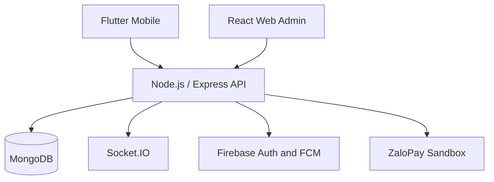

# Sport Energy - Sports Complex Management System

Hệ thống quản lý khu liên hợp thể thao, hỗ trợ đặt sân, lịch cố định, thanh toán, ghép trận và vận hành cơ sở thể thao. Dự án gồm ứng dụng Flutter Mobile, Web Admin React và Backend Node.js/Express.

## Chức năng chính

- Quản lý tài khoản và phân quyền `CUSTOMER`, `STAFF`, `ADMIN`.
- Đăng ký và đăng nhập bằng Firebase Authentication; xác thực email qua verification link.
- Backend xác thực Firebase ID Token, đồng bộ hồ sơ người dùng và cấp JWT cho các API nghiệp vụ.
- Quản lý cơ sở thể thao, môn thể thao, sân, khung giờ và thời gian bảo trì.
- Đặt sân, kiểm tra trùng lịch, tính giá, duyệt/hủy booking và quản lý lịch sử.
- Lịch cố định theo ngày/tuần, duyệt bởi STAFF/ADMIN và tự sinh booking.
- Tạo, tìm kiếm, tham gia, rời và quản lý phiên ghép trận thủ công.
- Thanh toán tiền mặt và ZaloPay Sandbox.
- Thông báo thời gian thực qua Socket.IO, thông báo đẩy qua Firebase Cloud Messaging.
- Báo cáo doanh thu, hiệu suất sân và giám sát vận hành.

## Vai trò và nền tảng

| Vai trò | Mobile Flutter | Web Admin React | Quyền chính |
|---|---:|---:|---|
| `CUSTOMER` | Yes | No | Đặt sân, thanh toán, lịch cố định, ghép trận, thông báo, hồ sơ |
| `STAFF` | Yes | Yes | Xử lý booking, thu ngân, quản lý sân/slot, duyệt lịch cố định, báo cáo cơ sở |
| `ADMIN` | Yes | Yes | Quản lý toàn hệ thống, người dùng, cơ sở, sân, báo cáo nâng cao |

## Kiến trúc



## Công nghệ

| Thành phần | Công nghệ |
|---|---|
| Mobile | Flutter, Dart, BLoC, get_it, go_router, Dio |
| Web Admin | React, TypeScript, Ant Design, TanStack Query, Recharts |
| Backend | Node.js, Express, JWT, bcrypt, Firebase Admin SDK, node-cron |
| Database | MongoDB, Mongoose |
| Xác thực và thông báo đẩy | Firebase Authentication, Firebase Cloud Messaging |
| Dịch vụ ngoài | Cloudinary, ZaloPay Sandbox |

## Nghiệp vụ nổi bật

### Đặt sân

1. Khách hàng chọn cơ sở, môn thể thao, sân, ngày và khung giờ.
2. Backend kiểm tra trạng thái sân, thời gian bảo trì và xung đột booking.
3. Hệ thống tính giá, tạo booking và hóa đơn ở trạng thái chờ xử lý.
4. STAFF/ADMIN xử lý booking hoặc thanh toán trực tuyến cập nhật trạng thái giao dịch.

### Ghép trận

Khách hàng tạo phiên ghép trận theo môn thể thao, cơ sở, sân, thời gian và số lượng thành viên. Các người dùng khác có thể tìm kiếm phiên đang mở, gửi yêu cầu tham gia hoặc rời phiên. Chủ phòng có thể duyệt thành viên và quản lý trạng thái phiên.

### Lịch cố định

Khách hàng tạo lịch theo ngày hoặc tuần. STAFF/ADMIN phê duyệt lịch; hệ thống tự động sinh các booking trong phạm vi áp dụng, đồng thời hỗ trợ tạm dừng, tiếp tục và hủy một buổi cụ thể.

## Cấu trúc dự án

```text
.
├── node_be_refactor/       # Backend Node.js / Express
├── sport_management/       # Flutter Mobile application
└── react-staff-admin/      # React Web Admin application
```

## Yêu cầu môi trường

| Phần mềm/Dịch vụ | Yêu cầu |
|---|---|
| Git | Dùng để tải mã nguồn và quản lý phiên bản |
| Node.js và npm | Node.js 18 trở lên, npm đi kèm |
| Flutter SDK | Phiên bản tương thích với `pubspec.yaml` |
| Android Studio và Android SDK | Dùng để chạy ứng dụng Android trên thiết bị thật hoặc emulator |
| MongoDB | MongoDB Atlas hoặc MongoDB chạy cục bộ |
| Firebase Project | Bật Firebase Authentication (Email/Password) và Firebase Cloud Messaging |
| Cloudinary | Lưu trữ hình ảnh |
| ZaloPay Sandbox | Kiểm thử thanh toán trực tuyến, không bắt buộc khi chỉ chạy các chức năng khác |

## Thiết lập nhanh

```bash
git clone https://github.com/huuanh2512/DoAnTotNghiep.git
cd DoAnTotNghiep
```

1. Cấu hình biến môi trường cho Backend.
2. Cấu hình Firebase cho Flutter và Web Admin.
3. Khởi động Backend trước.
4. Khởi động Web Admin hoặc Flutter Mobile.

## Chạy Backend

```bash
cd node_be_refactor
npm install
npm run dev
```

Backend mặc định chạy tại `http://localhost:3000`.

### Biến môi trường Backend

Tạo file `.env` và cấu hình các biến sau, không đưa giá trị bí mật lên Git:

```env
PORT=3000
MONGODB_URI=
JWT_SECRET=
JWT_REFRESH_SECRET=
JWT_EXPIRES_IN=15m
JWT_REFRESH_EXPIRES_IN=7d

CLOUDINARY_CLOUD_NAME=
CLOUDINARY_API_KEY=
CLOUDINARY_API_SECRET=

ZALOPAY_APP_ID=
ZALOPAY_KEY1=
ZALOPAY_KEY2=
ZALOPAY_CALLBACK_URL=

FIREBASE_PROJECT_ID=
FIREBASE_CLIENT_EMAIL=
FIREBASE_PRIVATE_KEY=
FRONTEND_URL=
NODE_ENV=development
```

Ngoài các biến trên, Backend cần Firebase Admin service account hợp lệ để xác thực Firebase ID Token và gửi FCM. Không commit file service account hoặc các giá trị bí mật lên Git.

## Chạy Flutter Mobile

```bash
cd sport_management
flutter pub get
flutter run
```

Cập nhật API base URL trong cấu hình mạng của ứng dụng trước khi chạy trên thiết bị thật hoặc emulator.

Để Firebase hoạt động trên Android, cần cấu hình đúng `google-services.json` và file `firebase_options.dart` cho Firebase Project đang sử dụng.

## Chạy Web Admin

```bash
cd react-staff-admin
npm install
npm start
```

Ví dụ file `.env` cho Web Admin:

```env
REACT_APP_API_BASE_URL=http://localhost:3000/api/v1
REACT_APP_SOCKET_URL=http://localhost:3000
REACT_APP_FIREBASE_API_KEY=
REACT_APP_FIREBASE_AUTH_DOMAIN=
REACT_APP_FIREBASE_PROJECT_ID=
REACT_APP_FIREBASE_APP_ID=
```

## Build triển khai

```bash
# Backend
cd node_be_refactor
npm start

# Flutter Android APK
cd sport_management
flutter build apk --release

# React Web Admin
cd react-staff-admin
npm run build
```

## API tiêu biểu

| Nhóm | Endpoint tiêu biểu |
|---|---|
| Firebase Auth bridge | `POST /api/v1/auth/firebase/register`, `POST /api/v1/auth/firebase/complete-email-verification`, `POST /api/v1/auth/firebase/login` |
| Booking | `POST /api/v1/booking`, `PUT /api/v1/booking/:id/cancel` |
| Fixed schedule | `POST /api/v1/fixed-schedule`, `PUT /api/v1/fixed-schedule/:id/approve` |
| Matching | `POST /api/v1/matching`, `POST /api/v1/matching/:id/join`, `POST /api/v1/matching/:id/leave` |
| Payment | `GET /api/v1/payment`, `POST /api/v1/zalopay/create-order` |
| Reports | `GET /api/v1/reports/court-performance`, `GET /api/v1/reports/advanced-performance` |

## Trạng thái và giới hạn hiện tại

- ZaloPay đang sử dụng môi trường Sandbox, chưa phải tích hợp production.
- Hoàn tiền tự động chưa được hiện thực hoàn chỉnh.
- Firebase Authentication được dùng cho Email/Password và verification link; Firebase FCM dùng để gửi thông báo đẩy.
- Chưa có ghép trận tự động qua hàng đợi trong phiên bản hiện tại.
- Chưa có cổng Web dành cho CUSTOMER.
- Ứng dụng tập trung cho Android; iOS chưa được kiểm thử và triển khai chính thức.
- Khi triển khai nhiều backend instance, cần bổ sung Redis adapter cho Socket.IO và job queue cho cron jobs.

## Bảo mật

- Firebase Authentication quản lý mật khẩu và trạng thái xác thực email.
- Backend kiểm tra Firebase ID Token bằng Firebase Admin SDK trước khi đồng bộ hồ sơ và cấp quyền truy cập API.
- API bảo vệ bằng JWT và phân quyền theo vai trò.
- Callback ZaloPay được xác thực chữ ký HMAC.
- Không commit `.env`, Firebase service account hoặc khóa ký ứng dụng vào repository.

## Tài liệu

Tài liệu nghiệp vụ, API, ERD, kiểm thử và triển khai được lưu trong thư mục báo cáo của dự án.
