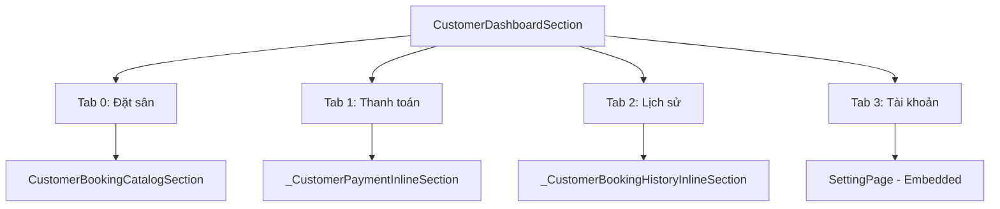

# TÀI LIỆU ĐẶC TẢ GIAO DIỆN (UI SPECIFICATION)

## DỰ ÁN: KHU LIÊN HỢP THỂ THAO (khulienhopthethao)

**Vai trò biên soạn:** Senior Flutter Architect\
**Mục đích:** Tài liệu đối chiếu (Reference) để tái lập toàn bộ hệ thống giao diện và logic tương tác UI sang một dự án mới mà không bị thiếu sót.

---

## I. TỔNG QUAN KIẾN TRÚC UI

Dự án được xây dựng theo mô hình **Modular Architecture** (đa mô-đun độc lập) dưới thư mục `modules/`. Mỗi mô-đun chứa một cấu trúc Clean Architecture thu nhỏ, trong đó tầng UI tập trung hoàn toàn tại thư mục `lib/persentation/` (lưu ý: lỗi chính tả của dự án hiện tại là `persentation`).

- **State Management:** Sử dụng thư viện `flutter_bloc` (Bloc & Cubit).
- **Routing:** Sử dụng `go_router` để quản lý các tuyến đường và điều hướng dạng Declarative, hỗ trợ Nested Navigation (`StatefulNavigationShell`).
- **Thông báo & Popup:** Sử dụng gói dùng chung `share_dependencies` với lớp `AppPopup` để quản lý Snackbar và Toast đồng bộ.
- **Định dạng Tiền tệ:** Lớp `AppCurrencyFormatter` dùng chung để hiển thị số tiền dạng VND hoặc ngoại tệ.

---

## II. ĐẶC TẢ CHI TIẾT TỪNG MÀN HÌNH (SCREENS / PAGES)

### 1. Màn hình Đăng nhập (SignInPage)

- **Đường dẫn file:** `modules/authentication_module/lib/persentation/ui/signin/pages/index.dart`
- **Tuyến đường (Route):** `UserPath.signIn`
- **Giao diện nền:** Sử dụng nền Gradient Linear xanh đậm (`#081E3F` -&gt; `#0A2B63` -&gt; `#0D3A7A`) kết hợp 2 hình tròn mờ (Cam: `#FF7A00` góc trên phải, Xanh: `#14E4A1` góc dưới trái) tạo hiệu ứng chiều sâu. Khung đăng nhập dạng Glassmorphism mờ nhẹ với viền trắng bán trong suốt.

#### Danh sách các Widgets chính & Logic tương tác:

| Tên Widget | Trạng thái (State) / Thuộc tính | Chức năng / Logic đặc thù |
| --- | --- | --- |
| **Form** | `_formKey` (GlobalKey) | Quản lý trạng thái Validation toàn bộ form nhập liệu. |
| **\_EnergyTextField (Email)** | `enabled: !isLoading` | Nhập Email đăng nhập. Kiểm tra trống và định dạng regex Email. |
| **\_EnergyTextField (Password)** | `enabled: !isLoading`, `obscureText: _obscurePassword` | Nhập mật khẩu. Kiểm tra trống và độ dài tối thiểu 6 ký tự. |
| **IconButton (Suffix Password)** | `onPressed` đổi trạng thái ẩn/hiện mật khẩu | Thay đổi thuộc tính `_obscurePassword` để hiển thị/ẩn mật khẩu. |
| **ElevatedButton (Đăng nhập)** | `onPressed` khi không loading | Kích hoạt `_submitSignIn()`, gọi `form.validate()`. Nếu hợp lệ, bắn sự kiện `SignIn` tới `UserBloc`. |
| **TextButton (Tạo tài khoản)** | `onPressed` khi không loading | Điều hướng người dùng sang màn hình Đăng ký (`UserPath.signUp`). |
| **CircularProgressIndicator** | Hiển thị khi `state is UserLoading` | Thay thế text "Đăng nhập ngay" trên nút bấm chính khi đang gửi yêu cầu. |

#### Luồng dữ liệu (State Flow):

- Lắng nghe (`BlocConsumer`) `UserBloc` với trạng thái `UserState`:
  - **UserLoading:** Vô hiệu hóa các trường nhập liệu và nút bấm, hiển thị loader.
  - **UserSignedIn:** Kiểm tra kết quả đăng nhập.
    - *Thành công:* Hiển thị SnackBar thành công, điều hướng sang màn hình tương ứng với vai trò qua hàm `_resolveDestinationByRole(role)` (Admin/Staff/Customer đều chuyển tới `HomePath.homeScreen` nhưng với dashboard khác nhau).
    - *Thất bại do chưa xác thực email:* Tự động chuyển hướng sang màn hình Xác thực email (`UserPath.verifyEmail`) kèm thông tin Email và Password trong `extra`.
    - *Thất bại khác:* Dịch mã lỗi qua `_localizeAuthErrorMessage` và hiển thị SnackBar lỗi màu đỏ.
  - **UserError:** Hiển thị SnackBar báo lỗi chi tiết. Nếu là lỗi chưa xác thực, tự động chuyển sang trang xác thực email.

#### Assets / Icons & Dependencies:

- **Icons:** `Icons.sports_soccer_rounded` (màu cam `#FF7A00`, kích thước 46 làm logo), `Icons.email_outlined`, `Icons.lock_outline`, `Icons.visibility_outlined`, `Icons.visibility_off_outlined`.
- **Dependencies:** `flutter_bloc`, `go_router`, `share_dependencies` (`AppPopup`).

---

### 2. Màn hình Đăng ký (SignUpPage)

- **Đường dẫn file:** `modules/authentication_module/lib/persentation/ui/signup/pages/index.dart`
- **Tuyến đường (Route):** `UserPath.signUp`
- **Giao diện nền:** Gradient Linear dọc (`#041833` -&gt; `#0B2E63` -&gt; `#0E437E`) kết hợp hiệu ứng đốm sáng cam/xanh và khung Glassmorphism.

#### Danh sách các Widgets chính & Logic tương tác:

| Tên Widget | Trạng thái (State) / Thuộc tính | Chức năng / Logic đặc thù |
| --- | --- | --- |
| **Form** | `_formKey` | Quản lý Validation dữ liệu. |
| **IconButton (Back)** | `onPressed` khi không loading | Quay lại màn hình đăng nhập (`UserPath.signIn`). |
| **\_EnergyTextField (Họ tên)** | \- | Nhập họ tên người dùng. Validate không được bỏ trống. |
| **\_EnergyTextField (Email)** | `keyboardType: emailAddress` | Nhập email đăng ký. Validate regex đúng định dạng email. |
| **\_EnergyTextField (Mật khẩu)** | `obscureText: _obscurePassword` | Nhập mật khẩu. Validate tối thiểu 6 ký tự. |
| **\_EnergyTextField (Xác nhận)** | `obscureText: _obscureConfirmPassword` | Nhập lại mật khẩu. Validate trùng khớp với mật khẩu đã nhập ở trên. |
| **ElevatedButton (Đăng ký)** | `onPressed` khi không loading | Thực hiện đăng ký (`SignUp`). Gọi `validate()`, bắn event `SignUp` lên `UserBloc` với email và password. |

#### Luồng dữ liệu (State Flow):

- Lắng nghe (`BlocListener`) `UserBloc`:
  - **UserLoading:** Vô hiệu hóa tương tác người dùng.
  - **UserRegistered:**
    - *Thành công:* Hiện SnackBar thành công, chuyển hướng người dùng sang trang xác thực email (`UserRoutes.verifyEmail`) thông qua `context.goNamed` truyền kèm Email và Password dưới dạng `extra` để tự động hóa quy trình xác thực.
    - *Thất bại:* Hiện SnackBar lỗi dịch từ `_localizeAuthErrorMessage` (ví dụ: email đã tồn tại, mật khẩu quá yếu...).

#### Assets / Icons & Dependencies:

- **Icons:** `Icons.arrow_back_ios_new_rounded`, `Icons.person_outline`, `Icons.email_outlined`, `Icons.lock_outline`, `Icons.lock_reset`, `Icons.visibility_outlined`, `Icons.visibility_off_outlined`.

---

### 3. Màn hình Xác thực Email (VerifyEmailPage)

- **Đường dẫn file:** `modules/authentication_module/lib/persentation/ui/email_verification/pages/index.dart`
- **Tuyến đường (Route):** `UserPath.verifyEmail` (Nhận email và password từ constructor).
- **Giao diện nền:** Thiết kế Gradient tương tự màn đăng nhập.

#### Danh sách các Widgets chính & Logic tương tác:

| Tên Widget | Trạng thái (State) / Thuộc tính | Chức năng / Logic đặc thù |
| --- | --- | --- |
| **OutlinedButton (Mở app email)** | `onPressed` kích hoạt link `mailto:` | Mở ứng dụng Email mặc định trên thiết bị của người dùng qua `launchUrl`. |
| **ElevatedButton (Gửi lại email)** | `onPressed` bị vô hiệu hóa trong thời gian Cooldown hoặc khi đang xử lý | Gửi lại mã xác nhận qua Firebase Auth. Bắt đầu bộ đếm ngược Cooldown 45 giây. |
| **ElevatedButton (Đã xác thực)** | `onPressed` kích hoạt thử lại đăng nhập | Gọi hàm `_retrySignIn()` bắn sự kiện đăng nhập lại để hệ thống kiểm tra trạng thái xác thực từ Firebase. |
| **TextButton (Quay về đăng nhập)** | `onPressed` quay về màn hình Login | Chuyển hướng về `UserPath.signIn`. |

#### Logic phức tạp đặc thù:

1. **Quy trình Gửi lại Email Xác thực:** Do quy định bảo mật của Firebase, để gửi lại email xác thực, hệ thống phải gọi `signInWithEmailAndPassword` tạm thời để lấy Session User, gọi `refreshed.sendEmailVerification()`, sau đó gọi ngay `signOut()` để bảo mật.
2. **Cooldown Timer:** Sử dụng `Timer.periodic` đếm ngược mỗi giây từ 45s về 0s để khóa nút gửi lại, tránh tình trạng spam API.

#### Luồng dữ liệu (State Flow):

- Lắng nghe `UserBloc`:
  - **UserSignedIn:** Nếu thành công (nghĩa là email đã được kích hoạt thực sự trên Firebase), chuyển hướng sang màn hình Home dựa trên vai trò. Nếu lỗi "email chưa xác thực" vẫn trả về, hiện SnackBar cảnh báo.
  - **UserError:** Hiển thị SnackBar thông báo lỗi tương ứng.

#### Assets / Icons & Dependencies:

- **Icons:** `Icons.mark_email_unread_outlined` (màu cam nhạt `#FFC266`), `Icons.open_in_new_rounded`, `Icons.send_rounded`, `Icons.verified_outlined`.
- **Dependencies:** `firebase_auth`, `share_dependencies` (gói mở URL ngoài).

---

### 4. Màn hình Danh sách sân & Lọc khung giờ (CustomerBookingCatalogSection)

- **Đường dẫn file:** `modules/booking_module/lib/persentation/ui/customer_booking_catalog_section.dart`
- **Phạm vi áp dụng:** Đây là một Widget phức tạp được nhúng trực tiếp vào Tab "Đặt sân" của Khách hàng và Tab "Tổng quan" của Nhân viên (Staff).

#### Danh sách các Widgets chính & Logic tương tác:

| Tên Widget | Trạng thái (State) / Thuộc tính | Chức năng / Logic đặc thù |
| --- | --- | --- |
| **IosDateNavigator** | `selectedDate`, `minDate` (hôm nay), `maxDate` (31/12 cuối năm) | Thanh chọn ngày cuộn ngang mượt mà. Đổi ngày sẽ xóa cache slot cũ và kích hoạt tải lại slot mới. |
| **ChoiceChip (Môn thể thao)** | `selected` theo `_selectedSportCategoryId` | Lọc nhanh danh sách sân theo môn thể thao được chọn (hoặc "Tất cả môn"). |
| **InkWell (Thẻ sân)** | `onTap` chuyển sang trang chi tiết | Bấm vào thẻ sân sẽ chuyển sang màn hình đặt sân chi tiết cho khách (`CustomerBookingDetailPage`). |
| **GridView (Khung giờ ngang)** | Hiển thị danh sách giờ hoạt động | Hiển thị các slot giờ dưới dạng lưới nhỏ. Mỗi slot hiển thị giờ và trạng thái khả dụng. |

#### Logic phức tạp đặc thù:

1. **Phân nhóm dữ liệu (Grouping):** Sân hoạt động (`active`) sẽ được gom nhóm 2 cấp: Nhóm theo **Môn thể thao** -&gt; Trong môn thể thao gom nhóm theo **Cơ sở**.
2. **Tải dữ liệu song song (Parallel Fetching):** Với mỗi sân hiển thị, hệ thống dùng `Future.wait` chạy song song 2 API:
   - `getCourtSlotConfig(courtId)` để lấy giờ mở/đóng cửa và cấu hình slot gốc.
   - `getBookedSlotKeysForDate(courtId, selectedDate)` để lấy danh sách các slot đã bị đặt hoặc đang chờ duyệt trong ngày đó.
3. **Trạng thái hiển thị của Slot giờ:**
   - *Trống (Available):* Màu xanh/không màu, có thể bấm.
   - *Đã có người đặt (Booked):* Màu đỏ mờ, hiển thị nhãn "Đã có người đặt", khóa tương tác.
   - *Chờ xác nhận (Pending):* Màu vàng nhạt, hiển thị nhãn "Chờ xác nhận", khóa tương tác.
   - *Không khả dụng / Bảo trì (Locked/Maintenance):* Màu cam mờ, hiển thị nhãn tương ứng, khóa tương tác.
   - *Khung giờ quá khứ:* Ẩn hoặc khóa nếu giờ bắt đầu của slot nhỏ hơn thời gian hiện tại.

#### Luồng dữ liệu (State Flow):

- Đọc trạng thái từ `BookingCatalogCubit` (`BookingCatalogState`):
  - **isCatalogLoading:** Hiển thị hiệu ứng loading xương (`_CustomerBookingCatalogLoadingSkeleton`).
  - **catalogErrorMessage:** Hiển thị text lỗi màu đỏ nếu có.

#### Assets / Icons:

- `Icons.location_city_rounded`, `Icons.apartment_rounded`, `Icons.chevron_right`.

---

### 5. Màn hình Chi tiết Đặt sân của Khách hàng (CustomerBookingDetailPage)

- **Đường dẫn file:** `modules/booking_module/lib/persentation/ui/customer_booking_detail_page.dart`
- **Tuyến đường (Route):** `BookingRoutes.customerBookingDetail` (Nhận tham số qua `CustomerBookingDetailArgs`).

#### Danh sách các Widgets chính & Logic tương tác:

| Tên Widget | Trạng thái (State) / Thuộc tính | Chức năng / Logic đặc thù |
| --- | --- | --- |
| **IosDateNavigator** | `enabled: !_isSubmitting` | Thay đổi ngày đặt sân trực tiếp từ trang chi tiết. Tự động reload lại danh sách slot. |
| **GridView (Slot giờ)** | Lắng nghe lượt chọn của người dùng | Cho phép người dùng chạm chọn duy nhất 1 khung giờ trống. Tô màu xanh viền đậm khi được chọn. |
| **TextFormField (Thời gian chọn)** | `readOnly: true`, `controller` | Hiển thị dạng chữ khung giờ và ngày đã chọn để người dùng đối chiếu trước khi gửi. |
| **FilledButton (Xác nhận đặt)** | `onPressed` kích hoạt đặt sân | Tiến hành đặt sân qua Cubit. Vô hiệu hóa khi đang submit. |

#### Logic phức tạp đặc thù:

- **Quy trình submit đặt sân:** Kích hoạt `createBooking()` với thông tin khách hàng lấy từ `UserBloc` hiện tại. Giao dịch mặc định ở chế độ `online` (cả loại đặt lịch và loại thanh toán).
- **Điều hướng sau thành công:** Hiện SnackBar hướng dẫn chờ nhân viên duyệt, sau đó chuyển hướng người dùng trực tiếp sang tab Lịch sử tại màn Home (`context.go('/home?tab=history')`).

#### Luồng dữ liệu (State Flow):

- Tương tác trực tiếp với `BookingCatalogCubit` để gửi lệnh tạo booking và nhận chuỗi lỗi `String? error` trả về từ API.

---

### 6. Màn hình Chi tiết Booking Quản lý (BookingDetailPage)

- **Đường dẫn file:** `modules/booking_module/lib/persentation/ui/booking_detail_page.dart`
- **Tuyến đường (Route):** Nhận `bookingId` làm tham số.

#### Danh sách các Widgets chính & Logic tương tác:

| Tên Widget | Trạng thái (State) / Thuộc tính | Chức năng / Logic đặc thù |
| --- | --- | --- |
| **Card (Thông tin Booking)** | Hiển thị chi tiết thực thể Booking | Hiển thị ID, Tên Khách, Cơ sở, Sân, Môn, Thời gian và Trạng thái hiện tại. |
| **FilledButton (Xác nhận)** | Chỉ hiển thị cho Staff/Admin khi booking ở trạng thái `pending` | Kích hoạt xác nhận đặt sân nhanh thông qua `confirmBooking()`. |
| **ListView (Invoices)** | Danh sách hóa đơn đi kèm | Hiển thị mã hóa đơn, số tiền (được định dạng), ngày phát hành và trạng thái thanh toán. |
| **ListView (Payments)** | Danh sách giao dịch đi kèm | Hiển thị ID giao dịch, phương thức thanh toán, mã hóa đơn và trạng thái. |

#### Logic phức tạp đặc thù:

- **Quyền hạn Staff/Admin:** Nút xác nhận booking chỉ được dựng lên nếu `role` của tài khoản đăng nhập là `staff` hoặc `admin` và trạng thái hiện tại của booking là `pending`. Sau khi bấm, gọi reload lại toàn bộ chi tiết.

#### Luồng dữ liệu (State Flow):

- Lắng nghe `BookingCatalogCubit` (`BookingCatalogState`) để hiển thị thông tin thực thể tương ứng với `bookingId` trong danh sách `state.bookings`.

---

### 7. Màn hình Quản lý Đặt lịch (BookingListPage - Dành cho Staff/Admin)

- **Đường dẫn file:** `modules/booking_module/lib/persentation/ui/booking_list_page.dart`
- **Tuyến đường (Route):** `BookingRoutes.bookingList`
- **Đặc thù giao diện:** Hỗ trợ cả chế độ nhúng (`embedded: true`) để hiển thị mượt mà bên trong Dashboard chính của Staff mà không bị chồng chéo thanh tiêu đề.

#### Danh sách các Widgets chính & Logic tương tác:

| Tên Widget | Trạng thái (State) / Thuộc tính | Chức năng / Logic đặc thù |
| --- | --- | --- |
| **TextField (Tìm kiếm)** | `controller: _searchController` | Tìm kiếm thời gian thực theo mã đặt lịch, tên khách hàng, cơ sở, sân hoặc môn thể thao. |
| **Status Chip Filter** | Lựa chọn: Tất cả, Chờ duyệt, Đã xác nhận, Hoàn thành, Đã hủy | Thay đổi bộ lọc hiển thị cục bộ (`_selectedStatusFilter`). |
| **FilledButton (Đặt lịch mới)** | `onPressed` hiển thị form đặt lịch | Nếu là khách -&gt; chuyển sang Wizard đặt sân. Nếu là Staff/Admin -&gt; Mở Dialog Form đặt lịch offline/online tại chỗ. |
| **ListView (Danh sách đặt lịch)** | `controller: _scrollController` | Hiển thị danh sách card đặt lịch, hỗ trợ tự động cuộn trang tải thêm (Infinite Scroll) khi cách đáy 160px. |
| **Card đặt lịch** | Chứa thông tin và các nút chức năng nhanh | Có các nút: Xác nhận (staff), Đổi lịch (reschedule), Hủy lịch (cancel) trực tiếp trên thẻ. |

#### Logic phức tạp đặc thù:

1. **Tự động lấy thông tin chi tiết khách hàng:** Vì API trả về đối tượng Booking chỉ chứa ID khách hàng thô, trang này có cơ chế **Prefetch** tự động (`_prefetchMissingCustomerNames`). Hệ thống duyệt qua danh sách hiển thị, lọc các ID khách hàng chưa có tên hoặc chưa có ảnh đại diện trong cache, gọi API `UserService().getProfile(customerId)` song song và cập nhật lại State để hiển thị tên thật cùng ảnh đại diện của khách hàng.
2. **Tạo Đặt lịch & Hóa đơn đồng thời tại quầy (Staff Flow):** Khi Nhân viên tạo đặt lịch cho khách vãng lai thông qua Dialog Form:
   - Gọi `createBooking` trên cubit.
   - Tìm kiếm booking vừa được tạo thông qua thông tin phòng/giờ (`findCreatedBooking`).
   - Tự động gọi tiếp API xác nhận thanh toán trực tiếp tại quầy (`confirmPaymentForBooking`) với chế độ `online` hoặc `offline` tùy thuộc vào khách trả tiền mặt hay chuyển khoản để hoàn tất giao dịch trong 1 luồng duy nhất.
3. **Lọc bỏ các booking cũ sau khi đổi lịch:** Các booking có trạng thái `rescheduled` (đã đổi sang lịch mới) sẽ được lọc bỏ khỏi danh sách quản lý trực tiếp để tránh rối mắt cho Staff, chỉ giữ lại trên DB làm lịch sử đối chiếu.

#### Luồng dữ liệu (State Flow):

- Lắng nghe `BookingCatalogCubit` để hiển thị danh sách đặt sân. Lắng nghe `UserBloc` để biết cơ sở quản lý được gán của Staff (Staff chỉ được thấy và tạo đặt lịch cho cơ sở của mình).

---

### 8. Màn hình Cấu hình Khung giờ Sân (StaffCourtSlotConfigPage)

- **Đường dẫn file:** `modules/facility_module/lib/persentation/ui/staff_court_slot_config_page.dart`
- **Tuyến đường (Route):** `FacilityPath.staffCourtSlotConfig`

#### Danh sách các Widgets chính & Logic tương tác:

| Tên Widget | Trạng thái (State) / Thuộc tính | Chức năng / Logic đặc thù |
| --- | --- | --- |
| **ChoiceChips (Chọn sân)** | `_selectedCourtId` | Hiển thị danh sách các sân thuộc cơ sở của Staff để chọn sân cấu hình. |
| **\_TimeFieldTile (Giờ mở cửa)** | `_openingTime` (TimeOfDay) | Hiển thị giờ mở cửa. Chạm vào sẽ mở `showTimePicker` để chỉnh sửa. |
| **\_TimeFieldTile (Giờ đóng cửa)** | `_closingTime` (TimeOfDay) | Hiển thị giờ đóng cửa. Chạm vào sẽ mở `showTimePicker` để chỉnh sửa. |
| **ChoiceChips (Độ dài slot)** | Lựa chọn: 30, 45, 60, 90 phút | Định nghĩa khoảng thời gian cho mỗi slot đặt sân. Thay đổi sẽ tự động chia lại khung giờ. |
| **GridView (Xem trước slot)** | Danh sách các slot dự kiến tạo | Hiển thị trực quan các khung giờ sẽ được tạo ra. |
| **Slot Card** | Nhấp để thay đổi trạng thái | Cho phép Staff chạm vào từng slot để đổi trạng thái vòng tròn: Khả dụng (Xanh) -&gt; Khóa (Đỏ) -&gt; Bảo trì (Cam). |
| **FilledButton (Lưu cấu hình)** | `onPressed` gọi API lưu | Gửi toàn bộ danh sách slot đã cấu hình lên server qua Cubit. |

#### Logic phức tạp đặc thù (Quy tắc Validation):

- **Giờ đóng cửa** bắt buộc phải sau **Giờ mở cửa**.
- Tổng thời gian vận hành tối thiểu phải đạt **120 phút** (2 tiếng).
- **Đặc biệt:** Tổng thời gian vận hành (tính bằng phút) phải chia hết cho độ dài một slot (ví dụ: mở từ 6h đến 22h = 16 tiếng = 960 phút. Chia hết cho slot 60 phút -&gt; Tạo ra 16 slot chẵn). Nếu không chia hết, nút lưu sẽ bị khóa kèm cảnh báo lỗi chia nhỏ khung giờ.

#### Luồng dữ liệu (State Flow):

- Lắng nghe `FacilityCatalogCubit` để load cấu hình slot hiện tại của sân (`getCourtSlotConfig`). Nếu chưa từng cấu hình, hệ thống tự sinh danh sách slot trống mặc định dựa theo giờ mở/đóng cửa mặc định (6h - 22h).

---

### 9. Màn hình Dashboard chính của Khách hàng (CustomerDashboardSection)

- **Đường dẫn file:** `modules/home_module/lib/persentation/ui/home/pages/customer/customer_dashboard_section.dart`
- **Cơ chế hoạt động:** Chứa `NavigationBar` phía dưới để chuyển đổi mượt mà giữa các tiểu phân vùng nội dung trực tiếp tại trang Home.

#### Phân chia các Tab nội dung chính:

#### Chi tiết các tiểu phân vùng (Inline Sections):

1. **Tab Đặt sân (CustomerBookingCatalogSection):** Hiển thị sơ đồ lưới chọn sân nhanh theo ngày như đặc tả ở mục 4.
2. **Tab Thanh toán (\_CustomerPaymentInlineSection):**
   - *Chức năng:* Hiển thị danh sách hóa đơn cần thanh toán của Khách hàng.
   - *Logic đặc biệt (Deep-link Focus):* Khi khách hàng bấm vào một thông báo đòi tiền từ màn hình khác, Router sẽ đẩy biến `focusInvoiceId` vào. Giao diện sẽ tự động cuộn (Scroll) đến thẻ hóa đơn đó, làm nổi bật viền bằng màu chủ đạo và tự động mở màn hình thanh toán chi tiết (`_showInvoiceDetail`).
3. **Tab Lịch sử (\_CustomerBookingHistoryInlineSection):**
   - *Chức năng:* Hiển thị danh sách đặt sân của Khách hàng. Hỗ trợ cuộn đến booking được chỉ định thông qua tham số `focusBookingId`.
4. **Tab Tài khoản (SettingPage):** Nhúng trực tiếp trang cài đặt thông tin cá nhân và đăng xuất.

---

### 10. Màn hình Dashboard chính của Nhân viên (StaffDashboardSection)

- **Đường dẫn file:** `modules/home_module/lib/persentation/ui/home/pages/staff/staff_dashboard_section.dart`
- **Cấu trúc giao diện:** Tương tự Khách hàng nhưng thay đổi hoàn toàn chức năng các Tab để phục vụ nghiệp vụ quản lý cơ sở.

#### Phân chia các Tab nghiệp vụ:

- **Tab 0 (Tổng quan):** Hiển thị sơ đồ sân hoạt động của cơ sở mà Staff được gán, giúp nhân viên trực quầy nắm nhanh sân nào đang trống/đầy trong ngày hôm nay mà không thể click đặt hộ (chỉ xem trạng thái trực quan).
- **Tab 1 (Vận hành sân):** Cung cấp các nút đi nhanh (Quick Actions) tới các trang:
  - *Cấu hình khung giờ sân* (`/staff/court-slot-config`)
  - *Quản lý sân* (`/catalog/courts`)
  - *Quản lý môn thể thao* (`/catalog/sports`)
- **Tab 2 (Đặt lịch):** Nhúng trực tiếp trang `BookingListPage` ở chế độ không có topbar để Staff thực hiện đặt sân trực tiếp tại quầy hoặc duyệt yêu cầu đặt sân của khách.
- **Tab 3 (Thanh toán):** Nhúng trang quản lý hóa đơn/thanh toán để xác nhận tiền mặt/offline từ khách hàng trực tiếp.
- **Tab 4 (Tài khoản):** Hiển thị thông tin cá nhân của Nhân viên, tên cơ sở đang làm việc và nút Đăng xuất.

---

### 11. Màn hình Chi tiết Hóa đơn & Thanh toán (InvoiceDetailPage)

- **Đường dẫn file:** `modules/payment_module/lib/persentation/ui/invoice_detail_page.dart`
- **Tuyến đường (Route):** `PaymentRoutes.invoiceDetail` (Nhận `invoiceId` tham số).

#### Danh sách các Widgets chính & Logic tương tác:

| Tên Widget | Trạng thái (State) / Thuộc tính | Chức năng / Logic đặc thù |
| --- | --- | --- |
| **Card (Thông tin hóa đơn)** | Hiển thị chi tiết thực thể Invoice | Tên sân, cơ sở, số tiền định dạng, trạng thái và ngày tạo hóa đơn. |
| **Card (Thông tin đặt sân)** | Gọi API tải thông tin chi tiết đặt sân | Hiển thị tên khách hàng, số điện thoại, thời lượng đặt và trạng thái đặt. |
| **FilledButton (Thanh toán Online)** | `onPressed` mô phỏng | Mô phỏng quy trình cổng thanh toán (Momo/VNPay) gửi callback thành công về server. |
| **FilledButton (Thanh toán Offline)** | Chỉ hiển thị cho Staff/Admin | Mô phỏng Staff thu tiền mặt tại quầy và bấm xác nhận đã thu tiền. |

#### Logic phức tạp đặc thù (Mô phỏng thanh toán):

- Trang này phục vụ môi trường thử nghiệm và vận hành thực tế bằng cách tích hợp chức năng mô phỏng:
  - *Online:* Sinh mã giao dịch tự động dạng `pay-[timestamp]`, gọi API `confirmOnlinePayment` với trạng thái `success` và số tiền khớp hóa đơn.
  - *Offline:* Nhân viên bấm nút sẽ kích hoạt `confirmOfflinePayment` truyền kèm mã nhân viên xác nhận và ghi chú ghi nhận thanh toán tại quầy.
- Sau khi thanh toán thành công, reload lại danh sách hóa đơn và chuyển hướng về danh sách thanh toán (`PaymentRoutes.paymentList`).

---

### 12. Màn hình Danh sách Người dùng (UserListPage - Dành cho Admin)

- **Đường dẫn file:** `modules/user_management_module/lib/persentation/ui/user_list_page.dart`
- **Tuyến đường (Route):** `UserRoutes.userList`

#### Danh sách các Widgets chính & Logic tương tác:

| Tên Widget | Trạng thái (State) / Thuộc tính | Chức năng / Logic đặc thù |
| --- | --- | --- |
| **TextField (Tìm kiếm)** | `_searchController` | Lọc danh sách người dùng thời gian thực theo Email. |
| **Dropdown (Cơ sở)** | Danh sách cơ sở khu liên hợp | Lọc danh sách nhân viên (Staff) theo cơ sở làm việc cụ thể. |
| **ChoiceChip (Vai trò)** | Lọc: Tất cả, Admin, Staff, Customer | Lọc nhanh người dùng theo phân quyền tài khoản. |
| **FilledButton (Thêm)** | `onPressed` mở form tạo mới | Mở Dialog Form để đăng ký nhanh tài khoản mới cho nhân viên hoặc khách. |
| **User Card** | Hiển thị thông tin người dùng | Email, Vai trò, Trạng thái (Active/Inactive), Cơ sở làm việc (nếu là Staff). |
| **IconButton (Edit)** | Mở Form sửa thông tin | Cho phép Admin chỉnh sửa nhanh vai trò, trạng thái hoặc đổi cơ sở làm việc của Staff. |
| **IconButton (Delete)** | Vô hiệu hóa tài khoản | Hiển thị Dialog xác nhận xóa. Nếu đồng ý, gọi API chuyển trạng thái tài khoản sang `inactive`. |

#### Logic phức tạp đặc thù (Tạo nhân viên mới):

- Khi Admin tạo người dùng mới qua Dialog:
  - Hệ thống gọi API `registerUser` để khởi tạo tài khoản trên Firebase (Mật khẩu mặc định tự sinh là `123456`).
  - Sau đó gọi liên tiếp các API bổ trợ: `updateUserRole` để gán quyền và `assignUserFacility` để gán cơ sở làm việc trực tiếp (nếu vai trò chọn là Staff).
  - Tự động tải lại danh sách sau khi hoàn thành.

#### Luồng dữ liệu (State Flow):

- Lắng nghe `UserManagementCubit` (`UserManagementState`) để cập nhật danh sách người dùng (`state.users`), hỗ trợ Infinite Scroll tải trang mới khi cuộn danh sách xuống dưới.

---

## III. BẢNG TỔNG HỢP ROUTING & TRẠNG THÁI (STATE) LIÊN QUAN

Dưới đây là bảng tổng hợp giúp lập trình viên nhanh chóng tra cứu và thiết lập cấu hình định tuyến cũng như quản lý trạng thái khi viết dự án mới:

| Tuyến đường (Route Path) | Tên Màn hình | Bloc/Cubit Lắng nghe | Trạng thái cần xử lý | Chức năng chính |
| --- | --- | --- | --- | --- |
| `/signin` | Login Screen | `UserBloc` | `UserInitial`, `UserLoading`, `UserSignedIn`, `UserError` | Đăng nhập hệ thống, kiểm tra xác thực email. |
| `/signup` | Register Screen | `UserBloc` | `UserLoading`, `UserRegistered`, `UserError` | Đăng ký tài khoản khách hàng mới. |
| `/verify-email` | Email Verification | `UserBloc` | `UserLoading`, `UserSignedIn`, `UserError` | Mở email xác thực, kích hoạt cooldown gửi lại. |
| `/home` | Dashboard (Multi-role) | `UserBloc`, `HomeBloc` | `HomeLoading`, `HomeLoaded`, `UserSignedIn` | Định tuyến hiển thị Dashboard theo vai trò. |
| `/bookings` | Booking List | `BookingCatalogCubit` | `isLoading`, `bookings`, `errorMessage` | Xem, duyệt, hủy và đổi lịch đặt sân. |
| `/catalog/facilities` | Facility Management | `FacilityCatalogCubit` | `isLoading`, `facilities`, `errorMessage` | Quản lý thông tin và phân quyền Staff cho cơ sở. |
| `/catalog/courts` | Court Management | `FacilityCatalogCubit` | `isLoading`, `courts`, `errorMessage` | Quản lý thông tin sân đấu và đơn giá giờ. |
| `/catalog/sports` | Sport Management | `FacilityCatalogCubit` | `isLoading`, `sports`, `errorMessage` | Quản lý danh mục các môn thể thao. |
| `/staff/court-slot-config` | Slot Configuration | `FacilityCatalogCubit` | `isLoading`, `errorMessage` | Staff thiết lập lưới giờ hoạt động của sân. |
| `/invoice/:invoiceId` | Invoice Detail | `PaymentCatalogCubit` | `isLoading`, `invoices`, `errorMessage` | Xem chi tiết hóa đơn, giả lập thanh toán. |
| `/users` | User Management | `UserManagementCubit` | `isLoading`, `users`, `errorMessage` | Admin quản lý tài khoản, vai trò và trạng thái. |

---

## IV. CÁC WIDGETS GIAO DIỆN DÙNG CHUNG ĐẶC THÙ (COMMON WIDGETS)

Khi xây dựng lại dự án mới, bắt buộc phải tái lập các Widget dùng chung dưới đây để đảm bảo giao diện thống nhất:

### 1. Widget Chọn ngày dạng iOS (IosDateNavigator)

- **Đường dẫn file gốc:** `modules/booking_module/lib/persentation/ui/widgets/ios_date_navigator.dart`
- **Mô tả UI:** Hiển thị một thanh hàng ngang gồm nút lùi ngày (bên trái), thông tin hiển thị ngày hiện tại (ở giữa), và nút tiến ngày (bên phải).
- **Tính năng đặc thù:**
  - Tự động khóa nút lùi ngày nếu ngày đang chọn trùng với `minDate` (hôm nay).
  - Tự động khóa nút tiến ngày nếu ngày đang chọn đạt giới hạn `maxDate` (cuối năm).
  - Bấm vào phần hiển thị ngày ở giữa sẽ mở một hộp thoại lịch (`showDatePicker`) để chọn ngày nhanh thay vì bấm tiến/lùi từng ngày.

### 2. Thẻ lọc nâng cao dùng chung (\_RosterFilterCard / \_SectionCard)

- **Mô tả UI:** Sử dụng màu nền tím nhạt nhẹ (`#EDEFFC`), bo góc lớn (`borderRadius: BorderRadius.circular(14)`) dùng làm thẻ bao bọc (Wrapper) cho toàn bộ các thanh tìm kiếm và bộ lọc trên các trang danh sách quản lý.
- **Logic micro-animation:** Riêng thẻ thông tin sân cấu hình (`StaffCourtSlotConfigPage`) hỗ trợ thuộc tính `highlighted`. Khi thuộc tính này kích hoạt bằng `true`, thẻ sẽ nhấp nháy đổi màu nền nhẹ nhàng để thu hút sự chú ý của nhân viên khi vừa được cuộn tới.

### 3. Hộp thoại thông báo nhanh (AppPopup)

- **Đường dẫn file gốc:** `modules/share_dependencies/lib/persentation/packages/popup/popup_package.dart`
- **Mô tả UI:** Đóng vai trò hiển thị SnackBar thông báo nhanh dưới đáy màn hình với 4 tông màu thiết kế hiện đại (Tone):
  - `success`: Màu xanh lá cây `#55E277` (Thông báo thành công).
  - `danger`: Màu đỏ `#D14343` (Thông báo lỗi API hoặc lỗi nhập liệu).
  - `warning`: Màu vàng/cam `#D17B13` (Thông báo cảnh báo cooldown, chọn thiếu dữ liệu).
  - `info`: Màu xanh dương `#4D79CC` (Thông báo thông tin tiến trình).