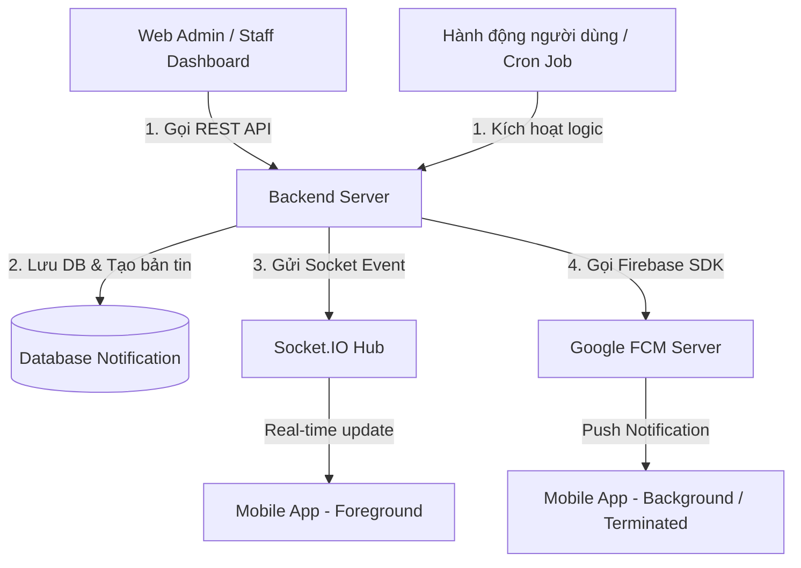

# 🔔 ĐẶC TẢ HỆ THỐNG THÔNG BÁO TRÊN MOBILE APP (MOBILE APP NOTIFICATION SYSTEM SPECIFICATION)
## Dành cho Tích hợp & Phát triển trên Web Staff, Web Admin & Backend Core

Tài liệu này đặc tả chi tiết toàn bộ hệ thống thông báo trên **Mobile App (Flutter Client)**, bao gồm cấu trúc Payload thông báo, các kịch bản kích hoạt (Trigger Scenarios), cơ chế điều hướng sâu (Deep Linking/Routing) và các chỉ dẫn cụ thể để các đội ngũ phát triển Web Staff, Web Admin và Backend triển khai đồng bộ.

---

## 1. 🏗️ Luồng Hoạt Động & Kiến Trúc Tổng Quan

Hệ thống thông báo hoạt động trên cơ chế lai (Hybrid) kết hợp giữa **Firebase Cloud Messaging (FCM)** cho việc đẩy tin nhắn (Push Notification) khi app ở chế độ nền/tắt, và **Socket.IO** cho việc đồng bộ dữ liệu thời gian thực khi ứng dụng đang chạy ở chế độ mở (Foreground).



### 1.1. Chu kỳ đăng ký Device Token (FCM Token Lifecycle)
Để gửi thông báo Push chính xác tới từng thiết bị người dùng:
1. Khi người dùng mở Mobile App lần đầu hoặc sau khi đăng nhập, App sẽ yêu cầu quyền nhận thông báo từ hệ điều hành.
2. Nếu được cấp quyền, App lấy **FCM Token** từ Google Firebase Service.
3. App gửi FCM Token lên Backend qua API: `POST /api/v1/user/register-fcm`.
4. Backend lưu FCM Token vào mảng `fcmTokens` trong bản ghi của User.
5. Khi người dùng Đăng xuất, Mobile App gọi API hủy đăng ký hoặc Backend tự động xóa token tương ứng để tránh rò rỉ thông báo sang thiết bị cũ.

---

## 2. 📋 Cấu Trúc Payload Thông Báo (FCM Data Payloads)

Mỗi bản tin thông báo được gửi đi qua FCM gồm hai phần:
- `notification`: Gồm `title` và `body` để hệ điều hành hiển thị trực tiếp trên thanh thông báo.
- `data`: Các trường metadata (cặp key-value dạng String) dùng để ứng dụng Mobile bắt sự kiện và thực hiện chuyển hướng (Deep Linking) tương ứng.

Dưới đây là đặc tả chi tiết payload của **5 nhóm thông báo chính**:

### 2.1. Nhóm Ghép Trận (MATCHING)
Dùng để thông báo các cập nhật về phòng ghép trận (Matchmaking), duyệt thành viên, hủy phòng hoặc ghép thành công.

* **Định tuyến trên Mobile:** Điều hướng trực tiếp tới trang Chi tiết Kèo đấu: `/matching/detail/<matchingSessionId>`.
* **Cấu trúc Payload JSON:**
```json
{
  "to": "<FCM_TOKEN_USER_OR_MULTICAST>",
  "notification": {
    "title": "Trận đấu đã gom đủ người! ⚽",
    "body": "Phòng ghép sân của bạn tại Cơ sở Bình Thạnh đã đủ thành viên và chuyển trạng thái hoạt động."
  },
  "data": {
    "type": "MATCHING",
    "matchingSessionId": "65b2cc351e289f001c23cafe",
    "click_action": "FLUTTER_NOTIFICATION_CLICK"
  }
}
```

### 2.2. Nhóm Đặt Sân (BOOKING)
Dành cho các thông báo phê duyệt đặt sân, yêu cầu thanh toán cọc hoặc hủy lịch đặt sân từ Staff/Admin.

* **Định tuyến trên Mobile:** Điều hướng trực tiếp tới trang Chi tiết Lịch đặt sân: `/booking/detail/<bookingId>`.
* **Cấu trúc Payload JSON:**
```json
{
  "to": "<FCM_TOKEN_USER>",
  "notification": {
    "title": "Lịch đặt sân đã được duyệt! ✅",
    "body": "Yêu cầu đặt sân Sân số 2 - Cụm sân Phú Thọ lúc 18:00 ngày 2026-06-15 đã được phê duyệt."
  },
  "data": {
    "type": "BOOKING",
    "bookingId": "65b2cc891e289f001c23cb20",
    "click_action": "FLUTTER_NOTIFICATION_CLICK"
  }
}
```

### 2.3. Nhóm Thanh Toán (PAYMENT)
Dùng để xác nhận thanh toán thành công, hoàn tiền hoặc cảnh báo hết hạn thanh toán giữ sân.

* **Định tuyến trên Mobile:** Điều hướng tới Lịch sử giao dịch hoặc Chi tiết hóa đơn: `/payment/detail/<paymentId>`.
* **Cấu trúc Payload JSON:**
```json
{
  "to": "<FCM_TOKEN_USER>",
  "notification": {
    "title": "Thanh toán thành công! 💳",
    "body": "Giao dịch chuyển khoản 200.000 VNĐ cho mã đặt sân #PT-9920 đã được xác nhận."
  },
  "data": {
    "type": "PAYMENT",
    "paymentId": "65b2ccb01e289f001c23cb33",
    "click_action": "FLUTTER_NOTIFICATION_CLICK"
  }
}
```

### 2.4. Nhóm Khuyến Mãi (PROMOTION)
Được gửi từ Web Admin để thông báo các chương trình ưu đãi, giảm giá giờ vàng.

* **Định tuyến trên Mobile:** Mở trang sự kiện hoặc WebView: `/promotion/detail/<promotionId>` hoặc mở URL đính kèm.
* **Cấu trúc Payload JSON:**
```json
{
  "to": "<FCM_TOKEN_USER_OR_TOPIC_ALL>",
  "notification": {
    "title": "Giờ vàng giá sốc! 🔥 Giảm ngay 30%",
    "body": "Nhập mã SANSANG30 khi đặt sân vào khung giờ từ 13:00 - 16:00 trong tuần này."
  },
  "data": {
    "type": "PROMOTION",
    "promotionId": "promo_sansang30",
    "link": "https://sportsapp.com/promotions/sansang30",
    "click_action": "FLUTTER_NOTIFICATION_CLICK"
  }
}
```

### 2.5. Nhóm Hệ Thống / Thông Báo Chung (SYSTEM)
Các thông báo bảo trì hệ thống, thay đổi chính sách sử dụng, hoặc cảnh báo tài khoản.

* **Định tuyến trên Mobile:** Mở trang chủ hoặc hiển thị Dialog thông báo tổng quát.
* **Cấu trúc Payload JSON:**
```json
{
  "to": "<FCM_TOKEN_USER>",
  "notification": {
    "title": "Hệ thống bảo trì định kỳ 🛠️",
    "body": "Hệ thống sẽ tạm thời bảo trì từ 01:00 đến 03:00 ngày 2026-06-01. Xin lỗi vì sự bất tiện này."
  },
  "data": {
    "type": "SYSTEM",
    "click_action": "FLUTTER_NOTIFICATION_CLICK"
  }
}
```

---

## 3. ⚡ Ma Trận Kịch Bản Kích Hoạt Thông Báo (Trigger Scenario Matrix)

Bảng dưới đây mô tả mọi trường hợp nghiệp vụ phát sinh thông báo, chỉ rõ **ai là người kích hoạt**, **ai nhận**, **qua kênh nào** và **loại payload**:

| Nghiệp vụ / Event | Tác nhân kích hoạt | Đối tượng nhận | Kênh truyền thông | Loại (Type) | Nội dung mẫu |
| :--- | :--- | :--- | :--- | :--- | :--- |
| **Yêu cầu đặt sân mới** | Khách hàng (Mobile App) | Nhân viên trực (Web Staff) | Socket.IO (`room_staff`) | `BOOKING` | *"Có lịch đặt sân mới đang chờ duyệt tại Cơ sở Bình Thạnh"* |
| **Phê duyệt lịch đặt** | Nhân viên (Web Staff) | Khách hàng đặt sân | FCM & Socket.IO (`user_<Id>`) | `BOOKING` | *"Lịch đặt sân của bạn ngày 15/06 đã được duyệt. Vui lòng thanh toán cọc."* |
| **Hủy lịch đặt sân** | Nhân viên (Web Staff) | Khách hàng đặt sân | FCM & Socket.IO (`user_<Id>`) | `BOOKING` | *"Rất tiếc! Lịch đặt sân của bạn ngày 15/06 đã bị hủy do trùng lịch thi đấu."* |
| **Nhận thanh toán đặt sân**| Hệ thống (Giao dịch ngân hàng) | Khách hàng đặt sân | FCM & Socket.IO (`user_<Id>`) | `PAYMENT` | *"Đã nhận thanh toán cọc đặt sân. Mã booking: #PT-1002"* |
| **Xin tham gia phòng ghép** | Người chơi B (Mobile App) | Chủ phòng (Host) | FCM & Socket.IO (`user_<HostId>`) | `MATCHING` | *"Người chơi [Tên] xin tham gia vào phòng ghép sân của bạn."* |
| **Duyệt người chơi** | Chủ phòng (Host) | Người chơi xin vào | FCM & Socket.IO (`user_<PlayerId>`) | `MATCHING` | *"Yêu cầu tham gia kèo đấu của bạn đã được Host phê duyệt! 🎉"* |
| **Hủy yêu cầu tham gia** | Chủ phòng (Host) | Người chơi xin vào | FCM & Socket.IO (`user_<PlayerId>`) | `MATCHING` | *"Yêu cầu tham gia kèo của bạn đã bị từ chối hoặc phòng đã đầy."* |
| **Phòng ghép đủ người** | Hệ thống (Đạt giới hạn số người) | Host & Tất cả thành viên | FCM & Socket.IO (`user_<AllMembers>`) | `MATCHING` | *"Phòng ghép sân đã gom đủ thành viên! Chuẩn bị ra sân thôi."* |
| **Chủ phòng hủy kèo** | Chủ phòng (Host) | Tất cả thành viên đã duyệt | FCM & Socket.IO (`user_<AllMembers>`) | `MATCHING` | *"Kèo đấu ngày [Ngày] đã bị hủy bởi Host."* |
| **Ghép trận tự động thành công** | Thuật toán Backend (Cron Job) | Tất cả thành viên ghép cặp | FCM & Socket.IO (`user_<MatchedUsers>`) | `MATCHING` | *"Ghép trận tự động thành công! Đã tự động lập phòng cho nhóm của bạn."* |
| **Bắn tin khuyến mãi** | Quản trị viên (Web Admin) | Toàn bộ Khách hàng | FCM Multicast hoặc FCM Topic | `PROMOTION` | *"Ưu đãi giờ vàng: Giảm 30% giá sân từ 13h - 16h hôm nay!"* |

---

## 4. 📱 Cơ Chế Xử Lý Điều Hướng Trên Mobile App (Flutter Client)

Để các lập trình viên Web & Backend nắm được cách Mobile App xử lý thông tin, dưới đây là logic điều hướng sâu (Deep Linking) được cài đặt trong `FcmService` của ứng dụng Flutter:

### 4.1. Phân biệt Trạng thái Hoạt động của App (App Lifecycle States)
Khi nhận tin nhắn FCM đẩy về, App chia làm 3 ngữ cảnh xử lý khác nhau:

1. **Foreground State (App đang mở trực tiếp trên màn hình):**
   - App không tự động chuyển màn hình đột ngột để tránh làm gián đoạn trải nghiệm của người dùng.
   - Thay vào đó, app sẽ lắng nghe và hiển thị một **AlertDialog/Toast nội bộ** để hỏi ý kiến người dùng:
     - *Nút "Bỏ qua":* Đóng hộp thoại.
     - *Nút "Xem chi tiết":* Chuyển hướng tới đúng route chi tiết (VD: `/matching/detail/<sessionId>`).

2. **Background State (App đang chạy ẩn hoặc khóa màn hình) & Terminated State (App đã bị tắt hoàn toàn):**
   - Khi người dùng nhấn vào banner thông báo trên thanh thông báo của điện thoại.
   - Hệ điều hành kích hoạt mở App, router sẽ ngay lập tức đẩy thẳng người dùng vào màn hình chi tiết tương ứng dựa trên `data.type` và ID đính kèm (VD: `matchingSessionId`, `bookingId`) mà không cần qua trang chủ.

### 4.2. Code Snippet tham khảo xử lý Payload trong Flutter (`fcm_service.dart`)
```dart
static void _handleMessagePayload(RemoteMessage message, {required bool isForeground}) {
  final data = message.data;
  final type = data['type'] as String?;

  if (type == 'MATCHING' && data['matchingSessionId'] != null) {
    final sessionId = data['matchingSessionId'] as String;

    if (isForeground) {
      // Đang ở màn hình: Hiện Dialog hỏi ý kiến
      final context = AppModuleRouter.navigatorKey.currentContext;
      if (context != null) {
        showDialog(
          context: context,
          builder: (context) => AlertDialog(
            title: Text(message.notification?.title ?? 'Ghép trận'),
            content: Text(message.notification?.body ?? 'Có cập nhật mới về trận đấu.'),
            actions: [
              TextButton(
                onPressed: () => Navigator.pop(context),
                child: const Text('Bỏ qua'),
              ),
              ElevatedButton(
                style: ElevatedButton.styleFrom(backgroundColor: const Color(0xFFFF5600)),
                onPressed: () {
                  Navigator.pop(context);
                  AppRouter.router.push('/matching/detail/$sessionId');
                },
                child: const Text('Xem chi tiết', style: TextStyle(color: Colors.white)),
              ),
            ],
          ),
        );
      }
    } else {
      // Đang chạy ngầm / tắt: Chuyển hướng trực tiếp
      AppRouter.router.push('/matching/detail/$sessionId');
    }
  }
  // Tương tự cho các kiểu dữ liệu BOOKING, PAYMENT, PROMOTION
}
```

---

## 5. 💻 Hướng Dẫn Tích Hợp Trên Web Staff & Admin (Dashboard)

Khi xây dựng các tính năng trên trang Web dành cho nhân viên trực sân (Web Staff) và người quản lý (Web Admin):

### 5.1. Xử lý Gửi Thông Báo (API Triggering)
Khi thực hiện các thao tác quản trị trên Web Dashboard (ví dụ Duyệt lịch đặt sân, Hủy đặt sân, tạo Sự kiện), Front-end Web chỉ cần gọi REST API tương ứng tới Backend (ví dụ `PUT /api/v1/booking/:id/status` với trạng thái mới). 

Backend sẽ chịu trách nhiệm chính trong việc:
1. Cập nhật cơ sở dữ liệu.
2. Lưu bản tin thông báo vào bảng `Notification` trong Database.
3. Bắn tín hiệu socket real-time tới Mobile Client qua Room `user_<userId>`.
4. Gọi Firebase Admin SDK đẩy Push Notification tới mảng thiết bị lưu trong `user.fcmTokens`.

### 5.2. Nhận Thông Báo Thời Gian Thực (dành cho Web Staff)
Nhân viên trực quầy cần nhận tin đặt sân mới từ khách hàng ngay lập tức để giữ/xác nhận sân:
1. **Kết nối Socket**: Web Client đăng nhập và kết nối tới Socket.IO server, tự động Join vào phòng `room_staff`.
2. **Lắng nghe sự kiện**: Lắng nghe event `booking_created` hoặc `new_notification`.
3. **Phản hồi UI/UX đề xuất**:
   - Tăng số badge chưa đọc trên góc chuông thông báo.
   - Hiển thị pop-up Toast (sử dụng `react-toastify` hoặc tương tự) ở góc màn hình chứa tóm tắt: *"Có lịch đặt sân mới tại Sân Phú Thọ - Chờ duyệt"*.
   - **Âm thanh cảnh báo**: Phát một đoạn âm thanh chuông "ping" ngắn (1-2 giây) để nhân viên trực quầy chú ý ngay lập tức, ngay cả khi đang mở tab làm việc khác.

---

> **Lưu ý quan trọng cho Backend:** 
> Luôn luôn kiểm tra mảng `fcmTokens` của người dùng. Khi gửi tin nhắn qua Firebase SDK, nếu nhận được lỗi token hết hạn/không hợp lệ (`messaging/invalid-registration-token` hoặc `messaging/registration-token-not-registered`), Backend phải lập tức `$pull` (xóa) token hỏng đó khỏi database của User để tối ưu hóa hiệu suất gửi tin cho các lần sau.
