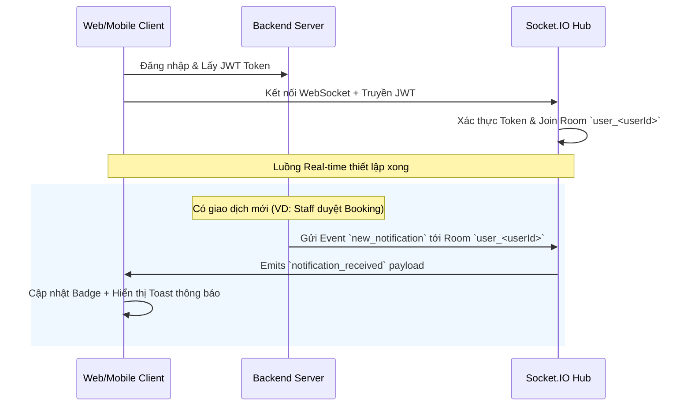

# 🔔 ĐẶC TẢ HỆ THỐNG THÔNG BÁO (NOTIFICATION SYSTEM SPECIFICATION)
## Dành cho Phát triển Backend & Web Dashboard (Staff & Admin)

Tài liệu này cung cấp thiết kế kiến trúc, đặc tả Database Schema, API Endpoints, và giải pháp truyền thông Real-time / Push Notification để phát triển module thông báo đồng bộ trên cả 3 nền tảng: **Mobile App (Customer)**, **Web Admin/Staff Dashboard**, và **Backend Core Server**.

---

## 1. 🗄️ Database Schema (MongoDB / Mongoose)

Để lưu trữ thông báo và hỗ trợ phân loại, trạng thái đọc của người dùng, chúng ta định nghĩa schema `Notification` như sau:

```javascript
const mongoose = require('mongoose');

const NotificationSchema = new mongoose.Schema({
  // Liên kết đến người nhận thông báo
  userId: {
    type: mongoose.Schema.Types.ObjectId,
    ref: 'User',
    required: true,
    index: true // Đánh index để truy vấn nhanh danh sách theo User
  },
  
  // Tiêu đề của thông báo
  title: {
    type: String,
    required: true,
    trim: true
  },
  
  // Nội dung chi tiết thông báo
  content: {
    type: String,
    required: true,
    trim: true
  },
  
  // Phân loại thông báo để định tuyến/hiển thị icon trên UI
  type: {
    type: String,
    enum: ['BOOKING', 'PAYMENT', 'SYSTEM', 'PROMOTION'],
    default: 'SYSTEM'
  },
  
  // Metadata bổ sung (ví dụ: bookingId, paymentId) để khi người dùng bấm vào sẽ chuyển màn hình tương ứng
  metadata: {
    bookingId: { type: String },
    paymentId: { type: String },
    link: { type: String }
  },
  
  // Trạng thái đọc thông báo
  isRead: {
    type: Boolean,
    default: false
  }
}, {
  timestamps: true // Tự động tạo createdAt, updatedAt (Dùng createdAt hiển thị thời gian)
});

// Compound Index để lấy nhanh danh sách thông báo chưa đọc của user
NotificationSchema.index({ userId: 1, isRead: 1, createdAt: -1 });

module.exports = mongoose.model('Notification', NotificationSchema);
```

---

## 2. 🌐 REST API Endpoints (ExpressJS)

Yêu cầu các API cần tích hợp Middleware xác thực người dùng (`Authorization: Bearer <token>`).

### 1️⃣ `GET /api/v1/notification/`
* **Mô tả:** Lấy danh sách thông báo của người dùng đang đăng nhập.
* **Query Parameters:**
  * `skip` (number) - Số bản ghi bỏ qua (phân trang), mặc định: `0`.
  * `limit` (number) - Số bản ghi tối đa trả về, mặc định: `10`.
* **Response Success (200 OK):**
  ```json
  {
    "success": true,
    "message": "Notifications retrieved successfully",
    "unreadCount": 3,
    "items": [
      {
        "_id": "507f1f77bcf86cd799439070",
        "userId": "507f1f77bcf86cd799439011",
        "title": "Đặt sân thành công",
        "content": "Lịch đặt sân của bạn vào ngày 2026-06-15 đã được gửi và đang chờ duyệt.",
        "type": "BOOKING",
        "isRead": false,
        "createdAt": "2026-05-27T09:10:00Z"
      }
    ],
    "total": 25
  }
  ```

### 2️⃣ `POST /api/v1/notification/` (ADMIN/STAFF ONLY)
* **Mô tả:** Tạo thông báo mới cho một người dùng cụ thể hoặc phát sóng toàn hệ thống.
* **Request Body:**
  ```json
  {
    "userId": "507f1f77bcf86cd799439011",
    "title": "Lịch đặt sân bị hủy",
    "body": "Lịch đặt sân của bạn vào ngày 2026-06-15 đã bị hủy bởi Quản trị viên.",
    "type": "BOOKING"
  }
  ```
* **Response Success (200 OK):**
  ```json
  {
    "success": true,
    "message": "Notification created successfully",
    "notification": {
      "_id": "507f1f77bcf86cd799439071",
      "userId": "507f1f77bcf86cd799439011",
      "title": "Lịch đặt sân bị hủy",
      "content": "Lịch đặt sân của bạn vào ngày 2026-06-15 đã bị hủy bởi Quản trị viên.",
      "type": "BOOKING",
      "isRead": false,
      "createdAt": "2026-05-27T09:12:00Z"
    }
  }
  ```

### 3️⃣ `PUT /api/v1/notification/:id/read`
* **Mô tả:** Đánh dấu một thông báo cụ thể là đã đọc.
* **Response Success (200 OK):**
  ```json
  {
    "success": true,
    "message": "Notification marked as read"
  }
  ```

### 4️⃣ `PUT /api/v1/notification/mark-all-read`
* **Mô tả:** Đánh dấu tất cả thông báo của người dùng hiện tại là đã đọc.
* **Response Success (200 OK):**
  ```json
  {
    "success": true,
    "message": "All notifications marked as read"
  }
  ```

---

## 3. ⚡ Giải pháp Real-time (Web & Mobile)

Để thông báo hiển thị ngay lập tức (không cần tải lại trang), hệ thống cần áp dụng cơ chế truyền tin Real-time:



### Kiến trúc Socket.IO khuyến nghị trên Backend:
1. **Connection & Authentication**: Khi Client thiết lập kết nối socket, bắt buộc gửi kèm JWT Token qua `handshake.auth`.
2. **Rooms**: Mỗi user tham gia vào một phòng riêng biệt có tên dạng `user_${userId}`. Các staff và admin có thể join thêm các phòng chung là `room_staff` và `room_admin`.
3. **Trigger Events**:
   * Khi Booking được tạo mới bởi Customer $\rightarrow$ Server gửi sự kiện thông báo tới phòng `room_staff` và `room_admin` (Đồng thời lưu DB).
   * Khi Staff/Admin duyệt Booking hoặc xác nhận Thanh toán $\rightarrow$ Server gửi sự kiện thông báo tới phòng `user_${customerId}` của khách đặt.

---

## 4. 📱 Push Notifications (Mobile FCM Integration)

Nhằm gửi thông báo kể cả khi người dùng đóng ứng dụng (Background / Terminated State):

1. **User Token Schema**: Bổ sung mảng `fcmTokens` vào Schema của `User` trên backend:
   ```javascript
   const UserSchema = new mongoose.Schema({
     email: String,
     role: String,
     fcmTokens: [{ type: String }] // Lưu các FCM token của các thiết bị
   });
   ```
2. **Device Registration API**: Mobile Client sau khi được cấp quyền thông báo sẽ gọi API `POST /api/v1/user/register-fcm` để gửi Token thiết bị lên server lưu trữ.
3. **Backend Triggering (Firebase Admin SDK)**:
   ```javascript
   const admin = require('firebase-admin');

   async function sendPushNotification(userId, title, body, payload = {}) {
     const user = await User.findById(userId);
     if (!user || !user.fcmTokens || user.fcmTokens.length === 0) return;

     const message = {
       notification: { title, body },
       data: { ...payload, click_action: "FLUTTER_NOTIFICATION_CLICK" },
       tokens: user.fcmTokens
     };

     const response = await admin.messaging().sendMulticast(message);
     // Clean up expired/invalid tokens
     if (response.failureCount > 0) {
       const invalidTokens = [];
       response.responses.forEach((resp, idx) => {
         if (!resp.success && (resp.error.code === 'messaging/invalid-registration-token' || resp.error.code === 'messaging/registration-token-not-registered')) {
           invalidTokens.push(user.fcmTokens[idx]);
         }
       });
       if (invalidTokens.length > 0) {
         await User.findByIdAndUpdate(userId, { $pull: { fcmTokens: { $in: invalidTokens } } });
       }
     }
   }
   ```

---

## 5. 💻 Web Client Integration (Staff & Admin)

Với giao diện Web Dashboard (ví dụ phát triển bằng React/Vite hoặc NextJS):

1. **Hiển thị Badge số lượng**:
   * Sử dụng Context hoặc Redux để lưu trữ `unreadCount` toàn cục.
   * Cập nhật `unreadCount` mỗi khi nhận sự kiện Socket.IO hoặc khi gọi API danh sách thông báo.
2. **Âm thanh & Toast**:
   * Khi nhận sự kiện thông báo mới (`new_notification`), phát một âm thanh cảnh báo ngắn (audio ping) để nhắc nhở nhân viên trực quầy.
   * Sử dụng các thư viện thông báo nổi tiếng như `react-toastify` hoặc `hot-toast` hiển thị pop-up ở góc phải màn hình.
3. **Web Push Notification API**:
   * Tận dụng Service Worker để đăng ký Web Push, giúp nhân viên trực quầy vẫn nhận được thông báo đặt sân mới ngay cả khi tab web đang bị ẩn hoặc trình duyệt thu nhỏ.
