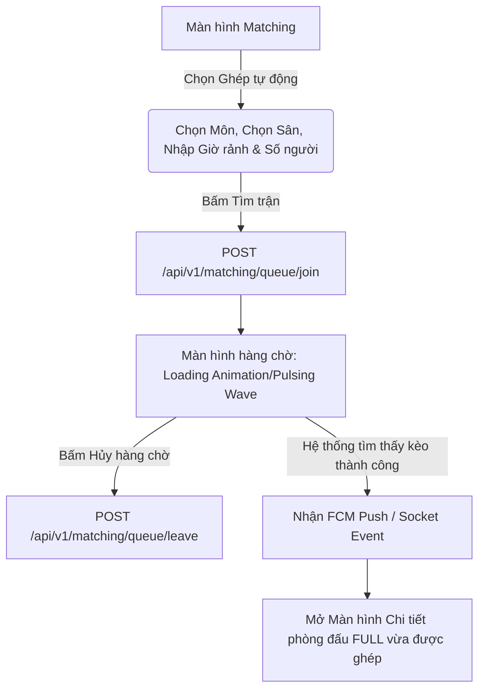

# 📱 HƯỚNG DẪN TRIỂN KHAI FRONTEND (FRONTEND INTEGRATION GUIDE)
## Hỗ trợ Hệ thống Ghép trận (Matchmaking System)

Tài liệu này hướng dẫn cách triển khai tính năng Ghép trận trên Frontend (Mobile App Flutter/React Native hoặc Web App React/Vue) kết nối đồng bộ với Backend Core qua **REST APIs**, **Socket.IO (Real-time)**, và **Firebase Cloud Messaging (Push Notification)**.

---

## 1. 🔑 Xác thực & Cấu hình Kết nối

Mọi API ghép trận đều yêu cầu Token JWT hợp lệ. Khi gọi API hoặc kết nối WebSocket, bắt buộc phải đính kèm Token này.

### 🌐 Gọi HTTP API (Ví dụ với Axios trong JS hoặc Dio trong Flutter)
* Header bắt buộc: `Authorization: Bearer <accessToken>`

### ⚡ Kết nối WebSocket (Socket.IO)
Khi người dùng đăng nhập thành công, thiết lập kết nối Socket và truyền token qua cấu hình `auth`:

```javascript
// Ví dụ Client JavaScript / React Native
import { io } from "socket.io-client";

const socket = io("http://<your-backend-ip>:3000", {
  auth: {
    token: accessToken // Truyền Token JWT vào đây để backend xác thực
  }
});

socket.on("connect", () => {
  console.log("Đã kết nối Socket.IO thành công, socket.id =", socket.id);
});
```

```dart
// Ví dụ Client Flutter (Dart)
import 'package:socket_io_client/socket_io_client.dart' as IO;

IO.Socket socket = IO.io('http://<your-backend-ip>:3000', 
  IO.OptionBuilder()
    .setTransports(['websocket'])
    .setAuth({'token': accessToken}) // Truyền token JWT
    .build()
);

socket.onConnect((_) {
  print('Đã kết nối Socket.IO thành công');
});
```

---

## 2. 🏟️ Luồng phòng ghép trận (Hosted Matches)

Luồng này dành cho trường hợp người dùng chủ động đăng phòng tìm đối hoặc tham gia phòng của người khác.

### Màn hình A: Danh sách phòng ghép (`GET /api/v1/matching`)
* **Thiết kế:** Hiển thị dưới dạng thẻ (Card) danh sách các kèo đấu đang mở (`status: OPEN`).
* **Lọc (Filter):** Cho phép người dùng lọc theo Môn thể thao (`sportId`), Cơ sở sân (`facilityId`), Ngày chơi (`bookingDate`), và số chỗ còn trống (`neededSpots`).
* **Hiển thị Card:**
  * Icon/Tên Môn thể thao (Bóng đá, Cầu lông...).
  * Tên Cụm sân + Địa chỉ.
  * Ngày & Khung giờ chơi (Ví dụ: `18:00 - 19:30`).
  * Chủ phòng: Tên & Avatar.
  * Số chỗ trống còn lại: `Available: X / Y` (Ví dụ: `Cần 2 / 5 người`).

### Màn hình B: Chi tiết phòng ghép & Real-time Update
Khi người dùng bấm vào một kèo đấu để xem chi tiết:
1. Gọi API `GET /api/v1/matching/:id` để lấy thông tin chi tiết.
2. **Gia nhập phòng Socket.IO:** Gửi sự kiện `join_matching_room` để lắng nghe cập nhật trực tiếp.

```javascript
// Gửi yêu cầu tham gia room socket khi vào màn hình chi tiết
socket.emit("join_matching_room", { matchingSessionId: "SESSION_ID_CẦN_THEO_DÕI" });

// Lắng nghe cập nhật thay đổi thành viên/trạng thái phòng
socket.on("matching_session_updated", (payload) => {
  console.log("Cập nhật phòng ghép trận:", payload);
  // payload.data chứa MatchingSession mới nhất
  // Cập nhật lại UI State (Danh sách thành viên, số lượng chỗ trống...)
  updateUI(payload.data);
});
```

* **Khi thoát màn hình chi tiết:** Bắt buộc gửi sự kiện rời room socket để tránh rác kênh truyền:
```javascript
socket.emit("leave_matching_room", { matchingSessionId: "SESSION_ID_CẦN_THEO_DÕI" });
socket.off("matching_session_updated");
```

### Các nút Hành động trên UI (Action Buttons)

Dựa vào vai trò của User hiện tại đối với phòng ghép trận, UI hiển thị các nút chức năng động:

#### 1. Nếu User là GUEST (Người xem phòng):
* **Chưa tham gia:** Hiển thị nút **"Xin gia nhập kèo"** $\rightarrow$ Gọi API `POST /api/v1/matching/:id/join`.
  * Nếu phòng bật `autoApprove: true` $\rightarrow$ Thêm trực tiếp vào nhóm, chuyển sang trạng thái APPROVED.
  * Nếu `autoApprove: false` $\rightarrow$ Chuyển nút thành trạng thái **"Đang chờ duyệt..."** (Trạng thái thành viên: `PENDING`).
* **Đã được duyệt (status = APPROVED):** Hiển thị nút **"Rời kèo đấu"** $\rightarrow$ Gọi API `POST /api/v1/matching/:id/leave` (nếu bận đột xuất).

#### 2. Nếu User là HOST (Chủ phòng):
* **Duyệt thành viên (Đối với danh sách PENDING):** 
  Hiển thị danh sách các người chơi đang xin tham gia phòng. Bên cạnh tên mỗi người có 2 nút **"Đồng ý"** (APPROVED) và **"Từ chối"** (REJECTED) $\rightarrow$ Gọi API `PUT /api/v1/matching/:id/members/:userId` với body `{ "status": "APPROVED" / "REJECTED" }`.
* **Hủy phòng:** Hiển thị nút **"Hủy kèo đấu"** ở góc màn hình $\rightarrow$ Gọi API `PUT /api/v1/matching/:id/status` với body `{ "status": "CANCELLED" }`.

---

## 3. ⚡ Luồng hàng chờ Ghép trận Tự động (Auto-Matchmaking Queue)

Luồng này dành cho những người chơi đơn lẻ hoặc nhóm nhỏ muốn hệ thống tự động tìm đối ghép sân.

### Luồng UX đề xuất:


### 1️⃣ Đăng ký Hàng chờ (`POST /api/v1/matching/queue/join`)
* **Giao diện:** Một Form đơn giản cho người dùng chọn:
  * Môn thể thao (`sportId`)
  * Cơ sở sân mong muốn (`facilityId`)
  * Ngày chơi (`bookingDate`)
  * Khung giờ có thể chơi (Giới hạn từ `startMinutes` tới `endMinutes`, ví dụ: rảnh từ 17:00 đến 21:00).
  * Số lượng người chơi đi cùng (`groupSize`, mặc định là 1).
* **Gọi API:** Gọi API đăng ký. Khi thành công, chuyển hướng người dùng sang **Màn hình Hàng chờ Tìm trận (Matchmaking Lobby)**.

### 2️⃣ Màn hình Hàng chờ (Matchmaking Lobby)
* **UI/UX:**
  * Hiển thị vòng tròn sóng âm lan tỏa (Pulsing Radar Wave) tạo cảm giác hệ thống đang quét tìm đối thủ.
  * Hiển thị đồng hồ bấm giờ tăng dần (Đã tìm kiếm: `00:05`, `00:06`...).
  * Hiển thị thông tin tóm tắt bộ lọc đang tìm kiếm (Ví dụ: "Đang tìm đối Cầu lông tại cơ sở Kỳ Hòa").
  * Hiển thị nút **"Hủy tìm kiếm"** ở góc dưới $\rightarrow$ Nếu bấm, gọi API `POST /api/v1/matching/queue/leave` và quay về màn hình trước.

---

## 4. 🔔 Nhận thông báo Push Notification (Firebase FCM)

Khi ghép trận thành công ở chế độ chạy nền hoặc khi có sự thay đổi, Backend sẽ bắn một Push Notification qua FCM. Frontend cần bắt sự kiện này để điều hướng (Deep Linking) người dùng đến đúng màn hình.

### Metadata payload từ Backend gửi về:
```json
{
  "type": "MATCHING",
  "matchingSessionId": "6a0f022b22c105b435bb0eee"
}
```

### Triển khai bắt sự kiện trong App Mobile (Ví dụ với Flutter Firebase Messaging):

```dart
// Lắng nghe khi người dùng bấm vào thông báo từ thanh trạng thái (Background/Terminated State)
FirebaseMessaging.onMessageOpenedApp.listen((RemoteMessage message) {
  final data = message.data;
  
  if (data['type'] == 'MATCHING' && data['matchingSessionId'] != null) {
    String sessionId = data['matchingSessionId'];
    
    // Điều hướng (Navigator) tới màn hình chi tiết phòng ghép trận tương ứng
    navigatorKey.currentState?.pushNamed(
      '/matching-detail',
      arguments: sessionId,
    );
  }
});

// Lắng nghe khi ứng dụng đang mở (Foreground State)
FirebaseMessaging.onMessage.listen((RemoteMessage message) {
  final data = message.data;
  
  if (data['type'] == 'MATCHING') {
    // Hiển thị một Toast / Banner thông báo tùy chỉnh góc trên màn hình
    showCustomToast(
      title: message.notification?.title ?? "Ghép trận",
      body: message.notification?.body ?? "",
      onTap: () {
        // Bấm vào Toast -> chuyển hướng sang chi tiết phòng ghép
        navigatorKey.currentState?.pushNamed(
          '/matching-detail',
          arguments: data['matchingSessionId'],
        );
      }
    );
  }
});
```

---

## 5. 🎨 Gợi ý Thiết kế giao diện (UI/UX Best Practices)

1. **Thẻ phòng ghép trận (Card UI):**
   * Sử dụng màu nền khác nhau hoặc huy hiệu (Badge) phân biệt các môn thể thao (Màu xanh cho Bóng đá, màu cam cho Cầu lông, màu vàng cho Tennis).
   * Hiển thị thanh tiến trình (Progress Bar) số lượng thành viên đã tham gia trên tổng số người cần. Ví dụ: Đã có 3/5 người $\rightarrow$ Thanh tiến trình hiển thị 60%.

2. **Chế độ hàng chờ tìm trận (Radar UI):**
   * Sử dụng ảnh động Canvas hoặc CSS Animation tạo hiệu ứng quét Radar quay vòng.
   * Để cải thiện trải nghiệm người dùng, hiển thị các câu chào/chờ ngẫu nhiên dưới màn hình (Ví dụ: "Hệ thống đang liên hệ với 12 người chơi cầu lông xung quanh...", "Đang kết nối sân bãi...").

3. **Thông báo chi phí (Cost Share):**
   * Nếu kèo đấu có đính kèm `bookingId`, hệ thống nên hiển thị gợi ý chia tiền trên đầu UI.
   * Ví dụ: "Tổng tiền sân: 200,000đ. Tạm tính chia đều cho 4 người: 50,000đ/người." giúp kích thích người chơi đăng ký nhanh hơn.
